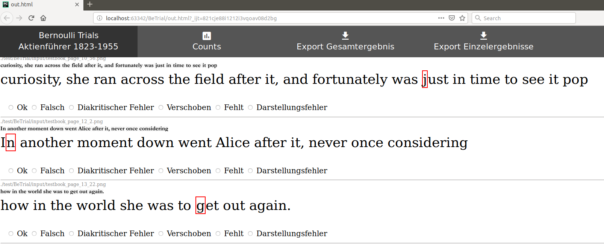
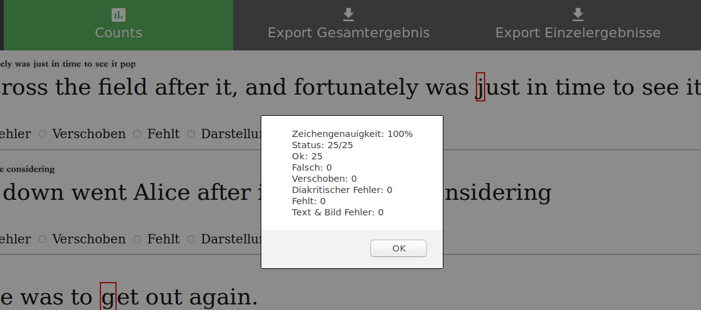
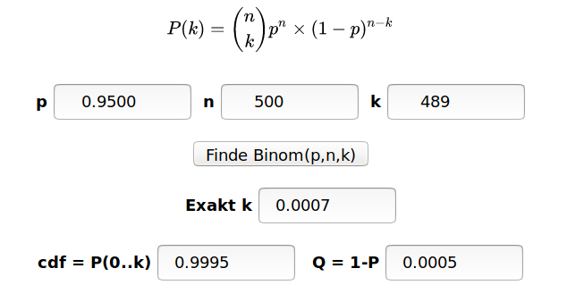
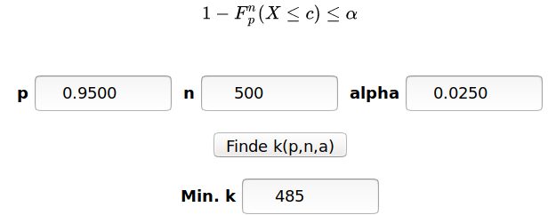

-------------------------------------
[](https://travis-ci.org/JKamlah/BeTrial)


## Overview
**Bernoulli trial generator tool for OCR result validation**

This repo is part of the [Aktienführer-Datenarchiv][akf-link] DFG project.
The DFG recommends the Bernoulli trial to validate OCR results.
To reduce the amount of effort to perform the test, a "Bernoulli Trial HTML Generator" was designed.
This generator work with Abbyy-XML-Files (*\*.xml*) and their JPG-image pendant (*\*.jpg*).


## Installation

This installation is tested with Ubuntu and we expect that it should
work for other similar environments similarly.

### 1. Requirements
- Python 2.7

### 2. Copy this repository
```
git clone https://github.com/UB-Mannheim/BeTrial.git
cd BeTrial
```

### 3. Dependencies can be installed into a Python Virtual Environment:

    $ virtualenv betrial_venv/
    $ source betrial_venv/bin/activate
    $ pip install -r requirements.txt

## Process steps

The whole projects has four major steps:

### Loading files from web

Load the files from the web ("filegetter.py").

    $ python ./filegetter.py (+ parameters)

### Creating a dataset
Create a set of files for the Bernoulli-Trials ("betrialgen.py")

    $ python ./betrialgen.py (+ parameters)


### Creating a html page with csv export
Create an interactive Bernoulli-Trial html ("betrial.py").

    $ python ./betrial.py (+ parameters)

### Evaluating the results
The betrial_eval html page helps to evaluate our results.

```bash
> firefox betrial_eval.html
```

Testcase
--------

Creating a dataset

    $ python ./betrialgen.py

Creating the html-page

    $ python ./betrial.py ./test/BeTrial/input/*.png

The validation page can be opened with firefox

```bash
> firefox out.html
```



You see the images of all the text lines from the dataset and
below each line there is the recognized text.
One of the character is marked with a red rectangle.
This character should be manually validated.
Therefore you can select one of the radio buttons below.
For example above you should check the letter `j` in the word `just`.
Which is `Ok`.

The button `Counts` displays an overview, about the current validation status.



The results can be stored with  `Export Gesamtergebnis` and `Export Einzelergenisse`
in `csv` files.

To evaluate the results, open the `betrial_evals.html` file:

```bash
> firefox betrial_eval.html
```

This page helps to calculate the cumulative distribution function (cdf).



And the necessary amount of successful events to proof the predicted accuracy
considering a certain error-probability.



Copyright and License
--------

Copyright (c) 2019 Universitätsbibliothek Mannheim

Author:
 * [Jan Kamlah](https://github.com/jkamlah)

**BeTrial** is Free Software. You may use it under the terms of the Apache 2.0 License.
See [LICENSE](./LICENSE) for details.


Acknowledgements
-------

The tools are depending on some third party libraries:
 * [ocropy][ocropy-link] is a collection of document analysis programs.
 One of them is [ocropus-gtedit][gtedit-link] which builds the basis of the "betrial.py" source code.
 ocropus-gtedit produces an editable html-page,
 where you can see the images of all the text lines and below each line the recognized text.
 The recognized text can be updated to produce ground truth data.
 * [Export2CSV][exportcsv-link] export the data to csv.
 * [Calculating Binom][binom-link] the calculation in the evaluation page are based on the implementation of Terry Ritter.

[akf-link]:  https://github.com/UB-Mannheim/Aktienfuehrer-Datenarchiv-Tools "Aktienfuehrer-Datenarchiv-Tools"
[dataarchive-link]: https://digi.bib.uni-mannheim.de/aktienfuehrer/ "Aktienfuehrer-Datenarchiv"
[ocropy-link]:  https://github.com/tmbdev/ocropy"
[exportcsv-link]: https://medium.com/@danny.pule/export-json-to-csv-file-using-javascript-a0b7bc5b00d2
[gtedit-link]: https://github.com/tmbdev/ocropy/wiki/Working-with-Ground-Truth
[binom-link]: http://www.ciphersbyritter.com/JAVASCRP/BINOMPOI.HTM